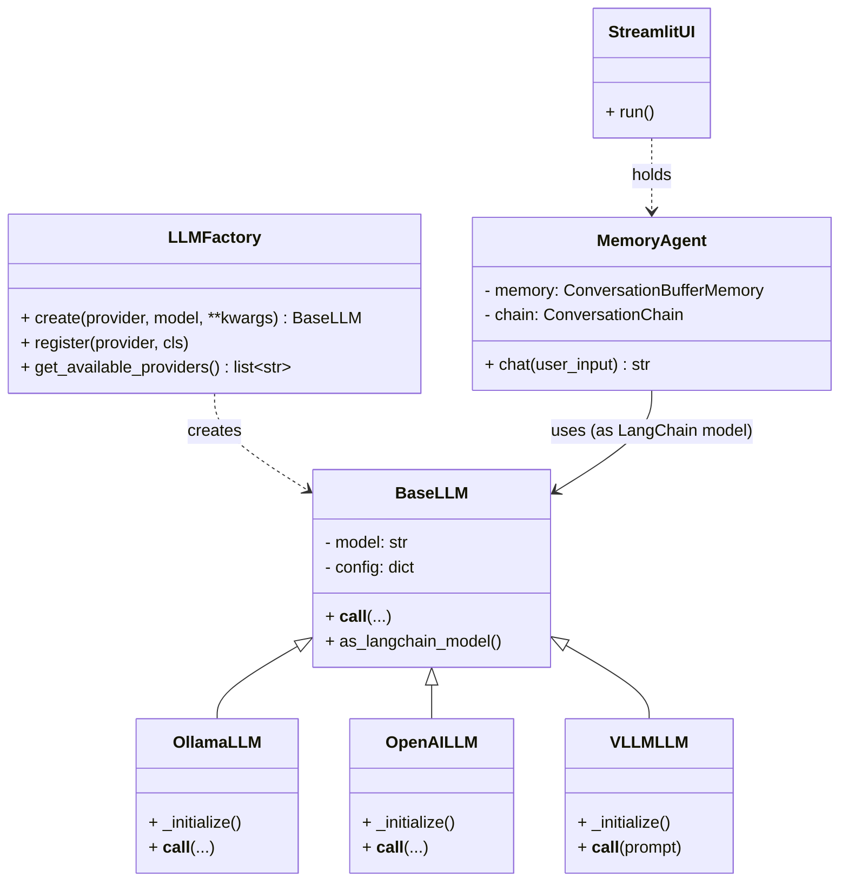

# 🤖 SOLID 기반 Multi-LLM 챗봇 프레임워크

[](https://www.python.org/)
[](https://www.langchain.com/)
[](https://en.wikipedia.org/wiki/SOLID)
[](LICENSE)

## 📋 개요

**SOLID 원칙**을 철저히 준수하여 설계된 확장 가능한 대화형 챗봇 프레임워크입니다.

핵심 기능:
- 🔄 **다중 LLM 지원**: Ollama(로컬) / OpenAI(클라우드) 간 동적 전환
- 🏭 **Factory 패턴**: 런타임에 LLM 제공자 선택
- 🔌 **MCP 프로토콜**: Model Context Protocol 기반 툴 서버
- 🧩 **모듈형 아키텍처**: 느슨한 결합(Loose Coupling)과 높은 응집도(High Cohesion)
- 🎨 **Streamlit UI**: 웹 기반 인터랙티브 인터페이스

## ✨ 주요 특징

### SOLID 원칙 완벽 적용
| 원칙 | 적용 사례 |
|------|-----------|
| **S**ingle Responsibility | 각 클래스는 하나의 책임만 (LLM, Agent, UI 분리) |
| **O**pen/Closed | Factory를 통한 확장 (새 LLM 추가 시 기존 코드 수정 불필요) |
| **L**iskov Substitution | 모든 LLM은 BaseLLM으로 치환 가능 |
| **I**nterface Segregation | 클라이언트는 필요한 인터페이스만 의존 |
| **D**ependency Inversion | 구체 클래스가 아닌 추상화(BaseLLM)에 의존 |

### 지원 LLM 제공자
- ✅ **Ollama**: 로컬 LLM (무료, 프라이버시 보장)
  - llama2, llama3, gemma, mistral 등
- ✅ **OpenAI**: 클라우드 LLM (API 키 필요)
  - gpt-4, gpt-3.5-turbo 등
- ✅ **vLLM(외부 서버)**: OpenAI 호환 엔드포인트 또는 전용 `/generate` 엔드포인트
- 🔜 **확장 가능**: Anthropic Claude, Google Gemini 등 추가 가능

## 폴더/파일 구조
```
project/
├─ llm/
│   ├─ __init__.py         # 모듈 인터페이스
│   ├─ base_llm.py         # LLM 추상 기반 클래스 (ABC)
│   ├─ ollama.py           # Ollama LLM 구현
│   ├─ openai_llm.py       # OpenAI LLM 구현
│   ├─ vllm_llm.py         # vLLM LLM 구현 (외부 서버 호출)
│   ├─ factory.py          # LLM Factory 패턴
│   └─ example_usage.py    # 사용 예제
├─ agent/
│   └─ memory_agent.py     # 메모리 기반 에이전트
├─ ui/
│   └─ streamlit_ui.py     # Streamlit UI
├─ mcp-server/
│   ├─ server/
│   │   └─ main.py         # MCP 서버 (pay 툴)
│   ├─ client/
│   │   └─ main.py         # MCP 클라이언트
│   └─ README.md           # MCP 실행 가이드
├─ main.py                 # 전체 조립 및 실행 엔트리포인트
├─ requirements.txt        # 의존성 목록
├─ RULES.md                # 프로젝트 개발 규칙(SOLID 등)
└─ README.md               # (이 문서)
```

## 🚀 빠른 시작

### 1️⃣ 필수 패키지 설치
```bash
pip install -r requirements.txt
```

### 2️⃣ LLM 제공자 선택 및 실행

<details open>
<summary><b>Option A: Ollama 사용 (로컬 LLM, 권장)</b></summary>

**장점**: 무료, 빠름, 프라이버시 보장

#### 설치 (최초 1회)
```bash
# Ollama 설치: https://ollama.ai/download

# 모델 다운로드
ollama pull gemma3n:e4b
# 또는
ollama pull llama2
```

#### 실행
```bash
# 터미널 1: Ollama 서버 실행
ollama serve

# 터미널 2: Streamlit UI 실행
streamlit run main.py
```

</details>

<details>
<summary><b>Option B: OpenAI 사용 (클라우드 LLM)</b></summary>

**장점**: 강력한 성능, 설치 불필요  
**단점**: API 키 필요, 비용 발생

#### Linux / macOS
```bash
export OPENAI_API_KEY='sk-your-api-key-here'
export LLM_PROVIDER='openai'
export LLM_MODEL='gpt-4'

streamlit run main.py
```

#### Windows (PowerShell)
```powershell
$env:OPENAI_API_KEY='sk-your-api-key-here'
$env:LLM_PROVIDER='openai'
$env:LLM_MODEL='gpt-4'

streamlit run main.py
```

</details>

<details>
<summary><b>Option C: 외부 vLLM 서버 사용 (URL 기반 서빙)</b></summary>

**장점**: 외부 호스팅의 장점, 확장/배포 용이

#### 1) .env 사용 (권장)
```plaintext
# vLLM 서버 URL (예: https://your-vllm-server-url.com)
LLM_PROVIDER=vllm
VLLM_SERVER_URL=https://your-vllm-server-url.com
```

#### 2) 환경변수 직접 설정
```bash
# Linux / macOS
export LLM_PROVIDER='vllm'
export VLLM_SERVER_URL='https://your-vllm-server-url.com'

streamlit run main.py
```

```powershell
# Windows (PowerShell)
$env:LLM_PROVIDER='vllm'
$env:VLLM_SERVER_URL='https://your-vllm-server-url.com'

streamlit run main.py
```

참고:
- vLLM 서버가 자체서명 인증서인 경우, 코드 레벨에서 `verify=False` 설정이 필요할 수 있습니다.
- 서버의 엔드포인트가 OpenAI 호환 베이스 URL이 아닌 전용 `/generate` 라우트를 사용하는 경우에도 `VLLM_SERVER_URL`만 올바르게 지정하면 동작합니다.
</details>

### 3️⃣ 웹 브라우저 접속
브라우저가 자동으로 열리거나, 수동으로 접속:
```
http://localhost:8501
```

### 4️⃣ MCP 서버 테스트 (선택사항)
```bash
cd mcp-server
python client/main.py
```
📖 자세한 내용: [mcp-server/README.md](mcp-server/README.md)

---

## 📦 환경변수 설정

.env 파일을 사용하여 환경변수를 설정합니다. `example.env` 파일을 참고하여 필요한 변수를 설정하세요.

```plaintext
# LLM 기본 설정
LLM_PROVIDER=ollama
LLM_MODEL=gemma3n:e4b

# OpenAI 사용 시
OPENAI_API_KEY=your-openai-api-key-here

# vLLM 외부 서버 사용 시
VLLM_SERVER_URL=https://your-vllm-server-url.com

# LangSmith 트레이싱 (선택)
LANGSMITH_TRACING=true
LANGCHAIN_ENDPOINT=https://api.smith.langchain.com
LANGCHAIN_API_KEY=
LANGCHAIN_PROJECT=langchain_study
```

추가 팁:
- UI 디버그 로그 표시를 원하면 `DEBUG_PROMPT=true`를 설정하세요. (콘솔에 프롬프트 히스토리 출력)
- vLLM 서버가 자체서명 인증서라면 `LLMFactory.create('vllm', ..., verify=False)`로 실행하거나 서버 인증서를 신뢰 저장소에 설치하세요.

---

## 🏗️ 아키텍처 다이어그램

```
┌─────────────────────────────────────────────────────────┐
│                     Streamlit UI                        │
│                   (streamlit_ui.py)                     │
└────────────────────┬────────────────────────────────────┘
                     │
                     ▼
┌─────────────────────────────────────────────────────────┐
│                    Memory Agent                          │
│                  (memory_agent.py)                       │
│         - ConversationBufferMemory                       │
│         - ConversationChain                              │
└────────────────────┬────────────────────────────────────┘
                     │
                     ▼
┌─────────────────────────────────────────────────────────┐
│                   LLM Factory                            │
│                   (factory.py)                           │
│         - create(provider, model)                        │
│         - register(provider, class)                      │
└──────────┬──────────────────────┬───────────────────────┘
           │                      │
           ▼                      ▼
┌──────────────────┐    ┌──────────────────┐
│   OllamaLLM      │    │   OpenAILLM      │
│  (ollama.py)     │    │ (openai_llm.py)  │
└──────────────────┘    └──────────────────┘
           │                      │
           └──────────┬───────────┘
                      │
                      ▼
           ┌──────────────────┐
           │    BaseLLM       │
           │  (base_llm.py)   │
           │   <<abstract>>   │
           └──────────────────┘
```

## 🧭 Mermaid 클래스 구성도



## 💡 개발 규칙

### SOLID 원칙 준수
- 자세한 내용: [RULES.md](RULES.md)
- 모든 코드 설계 및 구현 시 SOLID 원칙을 반드시 준수
- 각 모듈/클래스/함수는 **하나의 책임**만 갖도록 분리
- **확장에 개방**, **수정에 폐쇄**
- 추상화와 의존성 역전을 적극 활용

### 코드 스타일
- Python PEP 8 준수
- 타입 힌트 사용 권장
- Docstring 작성 (Google Style)

## LLM 추상화 아키텍처

### SOLID 원칙 적용
```python
# BaseLLM (추상 기반 클래스) - 의존성 역전 원칙
from llm import LLMFactory

# Factory 패턴으로 LLM 생성 - 개방/폐쇄 원칙
llm = LLMFactory.create('ollama', 'llama2')
# 또는
llm = LLMFactory.create('openai', 'gpt-4', temperature=0.7)

# 모든 LLM은 동일한 인터페이스 - 리스코프 치환 원칙
response = llm([HumanMessage(content="Hello")])
```

### 새로운 LLM 제공자 추가 방법
```python
from llm import BaseLLM, LLMFactory

class CustomLLM(BaseLLM):
    def _initialize(self):
        # 초기화 로직
        pass
    
    def __call__(self, *args, **kwargs):
        # 호출 로직
        pass

# 등록
LLMFactory.register('custom', CustomLLM)

# 사용
llm = LLMFactory.create('custom', 'model-name')
```

---

## 🧪 테스트

### 구조 테스트 (LLM 호출 없음)
```bash
python test_llm.py
```

### MCP 서버 테스트
```bash
cd mcp-server
python client/main.py
```

---

## 🔧 문제 해결

<details>
<summary><b>Ollama 연결 실패</b></summary>

**증상**: `Connection error` 또는 `Failed to connect to Ollama`

**해결방법**:
```bash
# Ollama 서버가 실행 중인지 확인
ollama serve

# 모델이 다운로드되어 있는지 확인
ollama list

# 모델 다운로드
ollama pull gemma3n:e4b
```
</details>

<details>
<summary><b>OpenAI API 키 오류</b></summary>

**증상**: `AuthenticationError` 또는 `Invalid API key`

**해결방법**:
```bash
# API 키가 올바르게 설정되었는지 확인
echo $OPENAI_API_KEY  # Linux/macOS
echo $env:OPENAI_API_KEY  # Windows PowerShell

# API 키 재설정
export OPENAI_API_KEY='sk-your-correct-api-key'
```
</details>

<details>
<summary><b>패키지 설치 오류</b></summary>

**증상**: `ModuleNotFoundError` 또는 의존성 충돌

**해결방법**:
```bash
# 가상환경 생성 및 활성화 (권장)
python -m venv venv
source venv/bin/activate  # Linux/macOS
venv\Scripts\activate  # Windows

# 패키지 재설치
pip install --upgrade pip
pip install -r requirements.txt
```
</details>

<details>
<summary><b>Streamlit 포트 충돌</b></summary>

**증상**: `Address already in use: 8501`

**해결방법**:
```bash
# 다른 포트 사용
streamlit run main.py --server.port 8502
```
</details>

---

## 🚀 확장 가이드

### 새로운 LLM 제공자 추가
```python
# llm/anthropic_llm.py
from llm import BaseLLM, LLMFactory
from langchain_anthropic import ChatAnthropic

class AnthropicLLM(BaseLLM):
    def _initialize(self):
        self.llm = ChatAnthropic(model=self.model, **self.config)
    
    def __call__(self, *args, **kwargs):
        return self.llm(*args, **kwargs)

# 등록
LLMFactory.register('anthropic', AnthropicLLM)
```

### 커스텀 Agent 추가
```python
# agent/custom_agent.py
from langchain.agents import AgentExecutor

class CustomAgent:
    def __init__(self, llm, tools):
        # Agent 로직 구현
        pass
```

### 추가 UI 프레임워크
- **FastAPI**: REST API 서버 구축
- **Gradio**: 빠른 프로토타이핑
- **Flask**: 경량 웹 서버

---

## 📚 기술 스택

| 카테고리 | 기술 | 용도 |
|---------|------|------|
| **LLM** | Ollama, OpenAI | 로컬/클라우드 언어 모델 |
| **Framework** | LangChain | LLM 애플리케이션 프레임워크 |
| **Protocol** | MCP | Model Context Protocol |
| **UI** | Streamlit | 웹 인터페이스 |
| **Pattern** | Factory, ABC | 디자인 패턴 |
| **Architecture** | SOLID | 소프트웨어 설계 원칙 |

---

## 📄 라이선스

MIT License - 자유롭게 사용, 수정, 배포 가능

---

## 🤝 기여하기

이슈, PR, 피드백 환영합니다!

1. Fork the repository
2. Create your feature branch (`git checkout -b feature/AmazingFeature`)
3. Commit your changes (`git commit -m 'Add some AmazingFeature'`)
4. Push to the branch (`git push origin feature/AmazingFeature`)
5. Open a Pull Request

---

**Made with ❤️ using SOLID principles** 