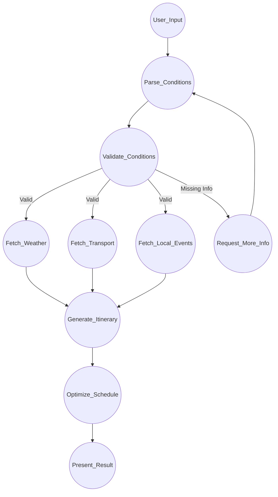

### user : 
     graph driven 방식으로 genAI agent를 만들꺼야.
     
     agent 용도는 user가 여행 조건을 입력하면 날씨, 교통편 등을 고려해서 여행 스케줄을 짜주는 거야.
     적당한 graph 를 만들어줘

### Chatgpt Agent : 
     좋아, Pearl 🌊.
     “여행 조건 → 날씨·교통·추천 → 여행 스케줄 생성”이라는 목표라면, **Graph-driven Agent 구조**는 아주 잘 맞는 선택이야.

---

## 🧭 전체 컨셉

이 Agent는 **Graph 기반 Workflow Orchestration**을 통해
사용자 입력 → 정보 수집 → 계획 생성 → 검증 → 출력의 단계를 노드로 분리해 자동화한다.

---

## 🧩 그래프 구조 (개념 설계)

---

## 🧠 각 노드 역할 설명

| 노드                      | 설명                                 | 입력          | 출력                 |
| ----------------------- | ---------------------------------- | ----------- | ------------------ |
| **User_Input**          | 사용자의 여행 요청을 받음                     | 자연어 문장      | Raw prompt         |
| **Parse_Conditions**    | 출발일, 목적지, 인원, 예산 등 파싱              | Raw prompt  | 구조화된 여행 조건(JSON 등) |
| **Validate_Conditions** | 조건이 충분한지, 날짜 범위 유효한지 확인            | 여행 조건       | 유효 조건 or 보완 요청     |
| **Fetch_Weather**       | 각 도시/날짜별 날씨 API 조회                 | 여행 조건       | 날씨 정보              |
| **Fetch_Transport**     | 항공/기차/버스 등 교통편 검색                  | 여행 조건       | 교통 정보              |
| **Fetch_Local_Events**  | 지역 이벤트, 명소 정보 검색                   | 여행 조건       | 지역 추천 정보           |
| **Generate_Itinerary**  | LLM 기반으로 일정 초안 생성                  | 조건 + 수집된 정보 | 초안 스케줄             |
| **Optimize_Schedule**   | 이동시간·날씨 고려해 최적화                    | 초안 스케줄      | 최적 스케줄             |
| **Present_Result**      | 사용자에게 보기 좋게 제시 (예: JSON, 표, 카드뷰 등) | 스케줄         | 결과                 |

---

## ⚙️ Graph-driven 구현 포인트

* **LangGraph / LangChain** 구조 예시:

  ```python
  from langgraph.graph import Graph

  graph = Graph()

  graph.add_node("parse_conditions", parse_conditions)
  graph.add_node("validate_conditions", validate_conditions)
  graph.add_node("fetch_weather", fetch_weather)
  graph.add_node("fetch_transport", fetch_transport)
  graph.add_node("fetch_local_events", fetch_local_events)
  graph.add_node("generate_itinerary", generate_itinerary)
  graph.add_node("optimize_schedule", optimize_schedule)
  graph.add_node("present_result", present_result)

  graph.add_edge("parse_conditions", "validate_conditions")
  graph.add_edge("validate_conditions", "fetch_weather")
  graph.add_edge("validate_conditions", "fetch_transport")
  graph.add_edge("validate_conditions", "fetch_local_events")
  graph.add_edge("fetch_weather", "generate_itinerary")
  graph.add_edge("fetch_transport", "generate_itinerary")
  graph.add_edge("fetch_local_events", "generate_itinerary")
  graph.add_edge("generate_itinerary", "optimize_schedule")
  graph.add_edge("optimize_schedule", "present_result")
  ```

---

## 🧩 확장 아이디어

| 기능                  | 추가 노드                      |
| ------------------- | -------------------------- |
| 사용자의 기분/선호 기반 맞춤 추천 | `Analyze_User_Preferences` |
| 예산 제약 최적화           | `Budget_Adjustment`        |
| 다중 사용자 협업 여행 계획     | `Merge_Preferences`        |
| 실시간 업데이트            | `Replan_On_Change`         |

---

원한다면,

* (1) **LangGraph 코드 형태로 실제 연결된 예제**
* (2) **각 노드의 LLM 프롬프트 설계**
* (3) **외부 API 호출 예시 (예: OpenWeather, Google Flights 등)**

중 하나를 바로 만들어줄게.
어느 단계부터 보고 싶어?
