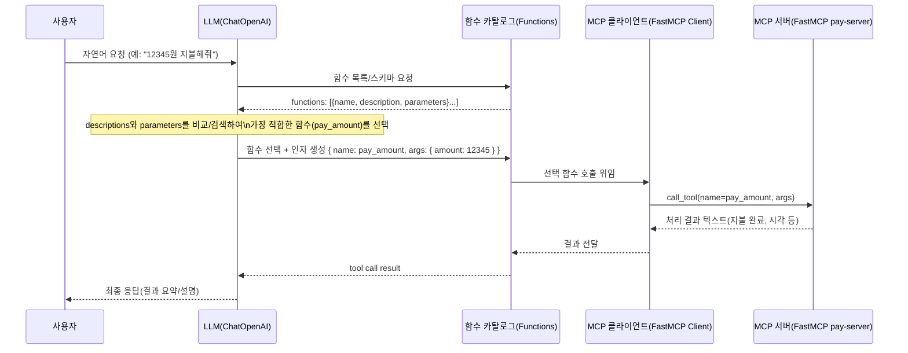

# FastMCP 기반 MCP 서버/클라이언트 실행 가이드

## 1. 의존성 설치

```
pip install -r requirements.txt
```

### .env 예시
```
# OpenAI
OPENAI_API_KEY=your_openai_key

# LangSmith (둘 중 하나)
LANGSMITH=your_langsmith_api_key
# 또는
LANGSMITH_API_KEY=your_langsmith_api_key

# 선택: LangSmith 프로젝트명 지정
LANGCHAIN_PROJECT=mcp-demo
```

## 2. 실행 방법

1) 서버(SSE) 독립 실행 (FastMCP)
```
python mcp-server/server/sse_main.py  # http://127.0.0.1:8765/sse
```

2) 클라이언트 실행 (분리된 엔트리)
```
# SSE 모드 (기본 URL: http://127.0.0.1:8765/sse)
python mcp-server/client/sse_main.py

# URL 변경 시 (PowerShell)
$env:MCP_SERVER_URL = 'http://127.0.0.1:9999/sse'; python mcp-server/client/sse_main.py

# STDIO 모드: 서버를 서브프로세스로 직접 실행
python mcp-server/client/stdio_main.py
# 또는 스크립트 경로 지정
$env:MCP_SERVER_SCRIPT = 'mcp-server/server/stdio_main.py'; python mcp-server/client/stdio_main.py
```

3) 멀티 서버 클라이언트 (Config 기반, LangChain 에이전트)
```
# 설정 파일: mcp-server/mcp_servers.json (환경변수 MCP_SERVERS_CONFIG로 교체 가능)
python mcp-server/client/multi_main.py

# 다른 설정 파일 사용
$env:MCP_SERVERS_CONFIG = 'your_config.json'; python mcp-server/client/multi_main.py
```

- 서버는 FastMCP의 `mcp.run(transport="sse", host, port)`로 구동되며, 클라이언트는 FastMCP `Client`로 접속합니다.
- 제공 툴: `pay_amount(amount:int)` — 정수 금액(원) 입력으로 지불 완료 메시지를 반환합니다.
- 멀티 서버 클라이언트(`client/multi_main.py`)는 LangChain `ChatOpenAI` 툴-콜링으로 MCP 툴을 자동 선택/호출합니다.
  - 실행 전 `OPENAI_API_KEY`가 필요합니다. 방법 중 하나:
    - .env에 `OPENAI_API_KEY` 설정(권장). LangSmith 사용 시 `.env`에 `LANGSMITH` 또는 `LANGSMITH_API_KEY`를 넣으면 자동 적용됩니다.

참고 문서: [FastMCP README](https://github.com/jlowin/fastmcp)

## 3. 디렉토리 구조
```
mcp-server/
  ├─ server/
  │    ├─ app.py        # FastMCP 서버 정의(도구 포함)
  │    ├─ sse_main.py   # SSE 실행 엔트리포인트
  │    └─ stdio_main.py # STDIO 실행 엔트리포인트
  ├─ client/
  │    ├─ sse_main.py    # SSE 전용 클라이언트
  │    ├─ stdio_main.py  # STDIO 전용 클라이언트
  │    ├─ multi_main.py  # 멀티 서버 클라이언트 (mcp_servers.json)
  │    └─ utils.py       # 공통 유틸(run_demo, print_available_tools)
  ├─ mcp_servers.json
  └─ requirements.txt
```

## 4. 참고
- FastMCP: https://github.com/jlowin/fastmcp
- MCP Python SDK: https://github.com/modelcontextprotocol/python-sdk

## 5. LLM → Functions → MCP Client → MCP Server 흐름

다음 다이어그램은 LLM이 함수(functions) 목록의 description/parameters를 확인해 적절한 함수를 선택하고, MCP 클라이언트를 통해 MCP 서버의 툴을 호출하는 전 과정을 보여줍니다.

